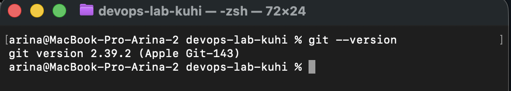
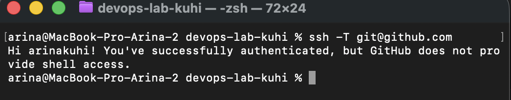
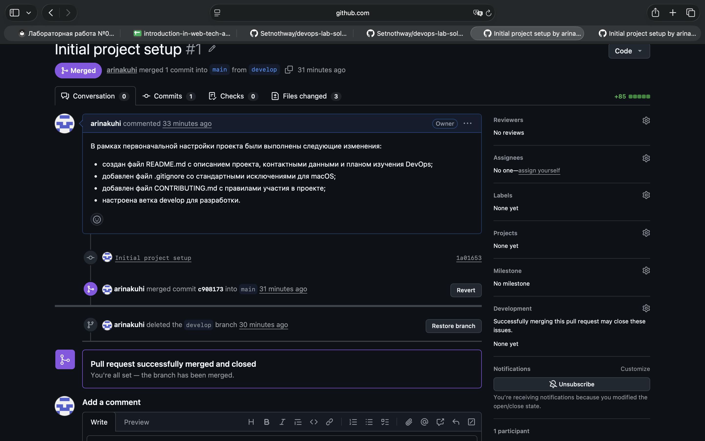
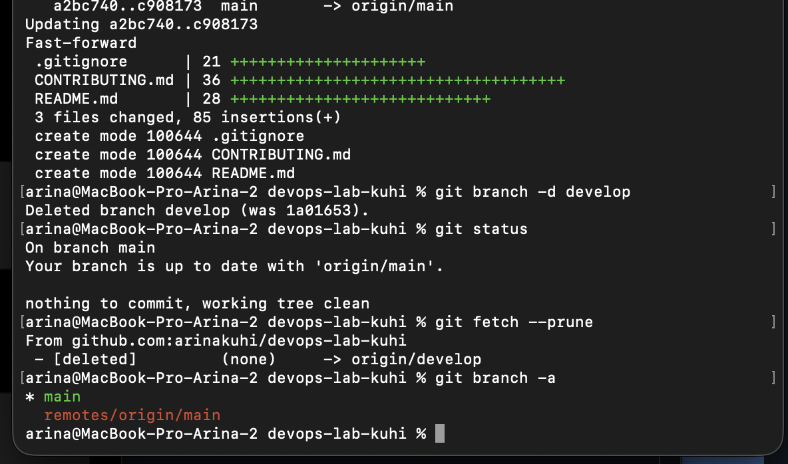

# Лабораторная работа №0

## Создание репозитория и настройка рабочего окружения

**Выполнила:** Arina Kuhi  
**GitHub:** https://github.com/arinakuhi  
**Репозиторий:** https://github.com/arinakuhi/devops-lab-kuhi  
**Дата выполнения:** 02.09.2026

## Цель работы

Научиться создавать репозитории, настраивать рабочее окружение и изучить основы работы с Git и GitHub.

## Используемое окружение

- Операционная система: macOS
- Терминал: zsh
- Git: 2.39.2 (Apple Git-143)
- Система контроля версий: Git
- Удалённый репозиторий: GitHub
- Способ подключения к GitHub: SSH

## Ход работы

### 1. Проверка установки Git

Для проверки установленной версии Git была выполнена команда:

```bash
git --version
```

Результат выполнения команды:

```text
git version 2.39.2 (Apple Git-143)
```



Таким образом, Git уже был установлен на компьютере и готов к использованию.

### 2. Настройка Git

Для корректного отображения автора коммитов были настроены имя пользователя и адрес электронной почты.

Были выполнены команды:

```bash
git config --global user.name "Arina"
git config --global user.email "arina.kuhi@mail.ru"
```

Проверка настроек выполнялась командами:

```bash
git config --global user.name
git config --global user.email
```

В результате Git был настроен для дальнейшей работы с репозиторием.

### 3. Создание и настройка SSH-ключа

Для безопасного подключения к GitHub по протоколу SSH был создан ключ типа ED25519.

Команда создания ключа:

```bash
ssh-keygen -t ed25519 -C "arina.kuhi@mail.ru"
```

Ключ был сохранён по стандартному пути:

```text
/Users/arina/.ssh/id_ed25519
```

Публичная часть ключа:

```text
/Users/arina/.ssh/id_ed25519.pub
```

Публичный SSH-ключ был скопирован в буфер обмена командой:

```bash
pbcopy < ~/.ssh/id_ed25519.pub
```

После этого публичный ключ был добавлен в настройки GitHub в раздел SSH keys под названием:

```text
MacBook Pro Arina
```

Для проверки подключения к GitHub была выполнена команда:

```bash
ssh -T git@github.com
```

В результате GitHub подтвердил успешную аутентификацию:

```text
Hi arinakuhi! You've successfully authenticated, but GitHub does not provide shell access.
```



### 4. Создание репозитория на GitHub

На GitHub был создан публичный репозиторий:

```text
devops-lab-kuhi
```

При создании репозитория автоматическое добавление README, `.gitignore` и лицензии было отключено, поскольку необходимые файлы создавались локально в ходе лабораторной работы.

Адрес репозитория:

https://github.com/arinakuhi/devops-lab-kuhi

### 5. Клонирование репозитория

Для получения локальной копии репозитория использовалось SSH-подключение.

Была выполнена команда:

```bash
git clone git@github.com:arinakuhi/devops-lab-kuhi.git
```

После клонирования был выполнен переход в директорию проекта:

```bash
cd devops-lab-kuhi
```

Проверка текущего каталога:

```bash
pwd
```

Результат:

```text
/Users/arina/devops-lab-kuhi
```

### 6. Подготовка основной ветки

Так как репозиторий был создан пустым, в ветке `main` был создан первоначальный пустой коммит:

```bash
git commit --allow-empty -m "Initialize repository"
```

После этого ветка `main` была отправлена на GitHub:

```bash
git push -u origin main
```

### 7. Создание ветки develop

Для выполнения изменений была создана отдельная ветка `develop`:

```bash
git switch -c develop
```

После выполнения команды Git сообщил:

```text
Switched to a new branch 'develop'
```

Все последующие изменения проекта выполнялись в ветке `develop`.

### 8. Создание README.md

В корне проекта был создан файл:

```text
README.md
```

В него были добавлены:

- описание проекта;
- данные автора;
- контактная информация;
- цель проекта;
- план изучения DevOps.

План изучения включает Git и GitHub, Linux, Docker, Docker Compose, CI/CD, GitHub Actions, Kubernetes, Infrastructure as Code, мониторинг и логирование.

### 9. Создание .gitignore

Для проекта был создан файл:

```text
.gitignore
```

В него были включены стандартные исключения для macOS, а также распространённые временные файлы и директории среды разработки.

В частности:

```text
.DS_Store
.AppleDouble
.LSOverride
.idea/
.vscode/
*.log
.env
__pycache__/
*.pyc
node_modules/
```

### 10. Создание CONTRIBUTING.md

Также был создан файл:

```text
CONTRIBUTING.md
```

В документе были определены правила:

- работы с ветками;
- оформления коммитов;
- создания Pull Request;
- внесения изменений в основную ветку проекта.

В качестве основной стабильной ветки используется `main`, а в качестве ветки разработки использовалась `develop`.

### 11. Подготовка изменений к коммиту

Состояние репозитория было проверено командой:

```bash
git status
```

Git определил три новых файла:

```text
.gitignore
CONTRIBUTING.md
README.md
```

Для добавления файлов в индекс была выполнена команда:

```bash
git add .
```

После этого файлы появились в разделе:

```text
Changes to be committed
```

### 12. Создание коммита

В соответствии с заданием был создан коммит с сообщением:

```text
Initial project setup
```

Команда:

```bash
git commit -m "Initial project setup"
```

В результате в коммит вошли три созданных файла:

```text
.gitignore
CONTRIBUTING.md
README.md
```

### 13. Отправка ветки develop на GitHub

Ветка `develop` была отправлена в удалённый репозиторий командой:

```bash
git push -u origin develop
```

После выполнения операции локальная ветка `develop` стала отслеживать:

```text
origin/develop
```

### 14. Создание Pull Request

На GitHub был создан Pull Request из ветки:

```text
develop
```

в ветку:

```text
main
```

Название Pull Request:

```text
Initial project setup
```

В описании были перечислены выполненные изменения:

- создание `README.md`;
- создание `.gitignore`;
- создание `CONTRIBUTING.md`;
- настройка ветки `develop`.

GitHub подтвердил отсутствие конфликтов между ветками.

### 15. Объединение Pull Request

После проверки Pull Request был объединён с основной веткой `main`.

GitHub создал merge-коммит:

```text
Merge pull request #1 from arinakuhi/develop
```

После объединения Pull Request получил статус:

```text
Merged
```



### 16. Удаление ветки develop

После успешного объединения удалённая ветка `develop` была удалена на GitHub.

Затем локальная ветка была удалена командой:

```bash
git branch -d develop
```

Git подтвердил удаление ветки:

```text
Deleted branch develop
```

Для удаления устаревшей информации об удалённых ветках была также выполнена команда:

```bash
git fetch --prune
```

### 17. Обновление локальной ветки main

После объединения Pull Request был выполнен переход в ветку `main`:

```bash
git switch main
```

Затем изменения из удалённого репозитория были загружены командой:

```bash
git pull origin main
```

После этого файлы:

```text
.gitignore
CONTRIBUTING.md
README.md
```

стали доступны в локальной ветке `main`.

### 18. Финальная проверка

Состояние репозитория было проверено командой:

```bash
git status
```

Результат:

```text
On branch main
Your branch is up to date with 'origin/main'.

nothing to commit, working tree clean
```

Также был выполнен просмотр всех веток:

```bash
git branch -a
```


Результат:

```text
* main
  remotes/origin/main
```

Таким образом, локальная и удалённая ветки `develop` были удалены, а в репозитории осталась основная ветка `main`.

## Результат

В результате выполнения лабораторной работы:

- создан аккаунт и настроена работа с GitHub;
- настроены имя и электронная почта Git;
- создан и добавлен SSH-ключ;
- проверена SSH-аутентификация GitHub;
- создан публичный репозиторий `devops-lab-kuhi`;
- репозиторий клонирован на локальный компьютер;
- создана ветка `develop`;
- создан файл `README.md`;
- создан файл `.gitignore`;
- создан файл `CONTRIBUTING.md`;
- выполнен коммит `Initial project setup`;
- ветка `develop` отправлена на GitHub;
- создан Pull Request `develop → main`;
- Pull Request успешно объединён;
- ветка `develop` удалена;
- локальная ветка `main` синхронизирована с удалённым репозиторием.

## Вывод

В ходе выполнения лабораторной работы были изучены основные принципы работы с Git и GitHub. Были получены практические навыки настройки Git, создания SSH-ключей, клонирования репозитория, работы с ветками, индексом и коммитами.

Также была практически изучена работа с Pull Request: изменения были выполнены в отдельной ветке `develop`, отправлены на GitHub, проверены и объединены с основной веткой `main`.

В результате было подготовлено рабочее окружение для дальнейшего изучения DevOps-практик.